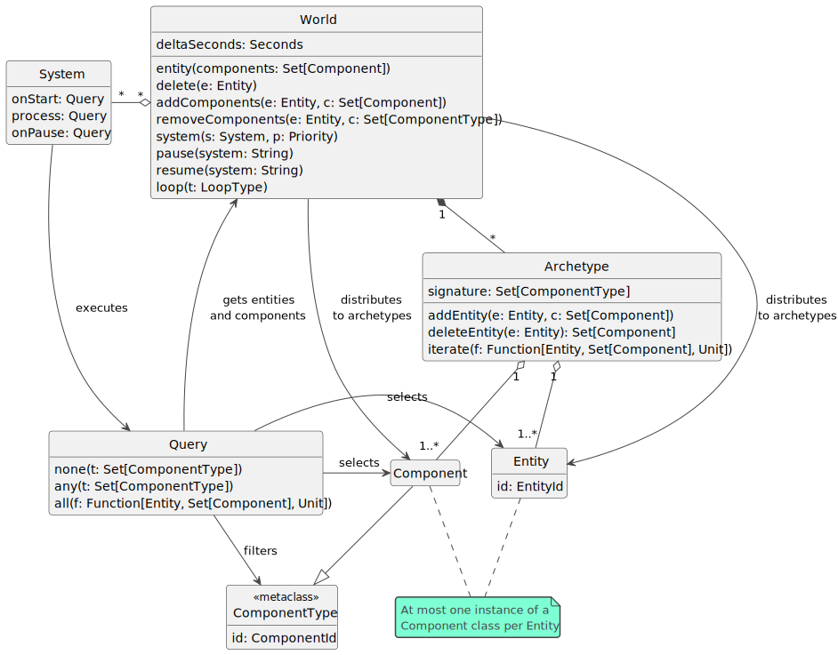

# Architettura

Dai requisiti è stata ricavata l'architettura riassunta dal seguente diagramma delle classi:

Più nel dettaglio, `World` è l'elemento cardine del framework: come da requisito utente 11, permette di eseguire tutte le operazioni di manipolazione su Entity e System specificate nel capitolo precedente.

La logica dei System è modellata attraverso l'interfaccia `Query`, che rappresenta costrutti simili alle query SQL e che verranno usate per filtrare le Entity e i loro Component. 

Ogni specializzazione dell'interfaccia `Component` è caratterizzata da un ID univoco dato dalla metaclasse `ComponentType`. Questa scelta architetturale è stata influenzata sia dal requisito di avere una sintassi dichiarativa per le Query (requisito non funzionale 1), sia dalla decisione di utilizzare Scala come linguaggio di programmazione (requisito di implementazione 1): senza anticipare dettagli di implementazione, si è voluto cercare un modo per costruire liste di classi di Component facendo a meno di determinati costrutti che avrebbero comportato una quantità di codice boilerplate non indifferente. Siccome questa scelta ha influenzato parecchio sia l'architettura che il design di dettaglio del framework, sembrava giusto menzionarla il prima possibile.

*Archetype* (archetipo) rappresenta la struttura dati scelta per memorizzare le Entity e i loro Component. È la stessa utilizzata da `flecs` e `Unity DOTS`, i due framework a cui questo progetto è ispirato, e il fatto che sia una soluzione molto popolare in ambito ECS soddisfa il requisito non funzionale 4. Un Archetype memorizza solo le Entity che abbiano uno specifico insieme di Component; ad esempio, le Entity con i soli Component *Position* e *Velocity* verranno memorizzate in un Archetype apposito, mentre quelle con Position, Velocity e *Rotation* verranno memorizzate in un altro Archetype completamente slegato dal primo. Per una spiegazione più dettagliata, si faccia riferimento a questo [link](https://medium.com/@ajmmertens/building-an-ecs-2-archetypes-and-vectorization-fe21690805f9).  
Come già appare evidente dal diagramma, aggiungere un Component a un'Entity equivale a eliminare l'Entity dall'Archetype in cui è memorizzata (ottenendo così i suoi Component già esistenti) e aggiungerla a un altro Archetype assieme ai suoi vecchi Component e a quello nuovo. Il discorso è analogo per quanto riguarda la rimozione dei Component.

Il vincolo di una sola istanza di un tipo di Component per Entity (requisito di sistema 3) è stato espresso tramite una nota.

I restanti requisiti verranno affrontati nei capitoli successivi.

Pagina successiva: [Design di dettaglio](./3_design.md)
