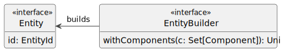
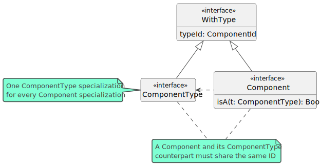
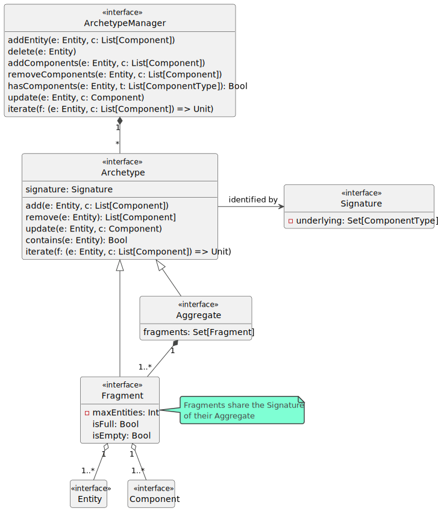
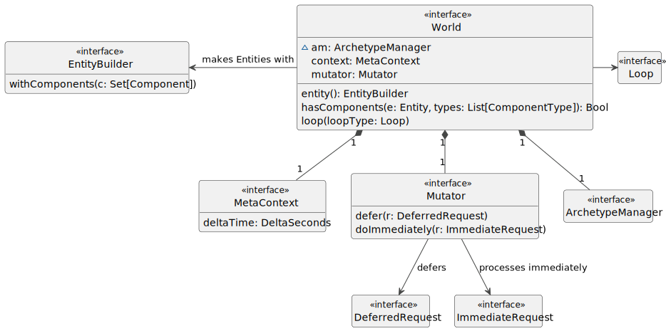

# Design di dettaglio

## Entity

`Entity` è il tipo più semplice di questo framework e ciò si riflette nel suo design:

In pieno stile ECS, rappresenta elementi senza alcuno stato e identificati da un `EntityId` univoco, il cui tipo sottostante viene lasciato come dettaglio implementativo.

Le Entity vengono istanziate attraverso l'interfaccia `EntityBuilder`, che modella un rudimentale *builder*. Nelle sezioni successive verrà spiegato come e dove vengono memorizzati i Component passati a `EntityBuilder` e le Entity da esso create, ma per il momento è importante notare che questo builder non restituisce alcuna Entity.

## Component

Il concetto di metaclasse di Component è stato tradotto nel seguente design:

Le interfacce `Component` e `ComponentType` dispongono di un campo `typeId` dato dall'interfaccia `WithType`. L'intento è quello di avere, per ogni specializzazione di `Component`, una controparte che specializzi `ComponentType` e che rappresenti il tipo di quella sottoclasse di `Component`. In questo modo, è possibile ricondurre le istanze di una classe Component al loro `ComponentType`.

Come nel caso di `EntityId`, la scelta del tipo di `ComponentId` non è pertinente a questa fase di design.

## Archetype

Sebbene il compito degli Archetype come struttura dati sia ben noto nel panorama ECS, non esiste un unico design che sia accettato come standard. Col seguente diagramma viene proposto un design ad-hoc per questo framework, prendendo spunto da quello di *Unity DOTS*:

Ispirandosi al pattern *Composite*, si è scelto di modellare gli Archetype come combinazione dei sottotipi `Aggregate` e `Fragment`: per memorizzare efficacemente Entity e Component, ogni `Aggregate` crea autonomamente istanze di `Fragment` a cui aggiungere eventuali Entity (assieme ai loro Component) create dall'utente, fino a un numero massimo prestabilito per Fragment. Al fine di soddisfare il requisito non funzionale 2, gli Aggregate devono sempre riutilizzare i propri Fragment non pieni e crearne di nuovi solo se tutti quelli di cui dispongono sono pieni; al contrario, i Fragment completamente vuoti andrebbero eliminati per non occupare inutilmente memoria e provocare grosse frammentazioni.  
Da qui in avanti, il termine *Archetype* verrà usato come sinonimo di *Aggregate*.

Ciascun Archetype è identificato da una *Signature*, ovvero un insieme di `ComponentType`. Questo fa sì che esista un singolo Archetype col compito di memorizzare le Entity con solo la combinazione di Component i cui tipi formano la Signature di quell'Archetype.

`ArchetypeManager` ha il compito di istanziare nuovi Archetype quando se ne presenta il bisogno (all'aggiunta di Entity con nuove combinazioni di Component, ad esempio) e distribuire agli Archetype appositi le Entity con combinazioni di Component già note. Si noti che, attraverso `ArchetypeManager`, è già possibile eseguire tutte le operazioni di manipolazione delle Entity previste dai requisiti utente 1, 3 e 5, più altre operazioni che verranno esplorate nei prossimi paragrafi e che soddisfano diversi altri requisiti.

## World

A partire dal design architetturale, il design di dettaglio di `World` è stato espanso come nella seguente figura:

`World` è, a tutti gli effetti, una *facade* su `ArchetypeManager`. Di fatto, l'utente non avrà mai bisogno (né tantomeno avrà la possibilità) di interfacciarsi con l'istanza di `ArchetypeManager` gestita da `World`: il framework può funzionare senza sapere che questi è basato su un design ad archetipi e, dunque, questi ultimi possono tranquillamente rimanere un mero dettaglio architetturale nascosto all'utente, con la possibilità in futuro di stravolgere questa parte dell'architettura, se necessario, mantenendo la stessa API.

Si noti l'uso di `EntityBuilder`: la memorizzazione delle Entity create attraverso di esso viene demandata ad `ArchetypeManager`.

Ai nuovi elementi introdotti sono stati dedicati alcuni paragrafi per spiegarne le funzionalità. 

### Mutator

L'introduzione degli Archetype ha comportato altre problematiche relative all'utilizzo della memoria oltre a quelle già affrontate nella discussione sui Fragment. Se immaginiamo un programma ECS in cui, come parte della logica di un System, le Entity vengono manipolate aggiungendo e rimuovendo una grossa quantità di Component in punti diversi del codice, verrebbero creati tanti nuovi Archetype quante sarebbero le nuove combinazioni di Component delle Entity; alcuni di questi Archetype hanno spesso solo un'utilità temporanea, nel senso che le Entity verrebbero spostate di Archetype in Archetype solo per poi "stanziarsi" in quello che rispecchia la combinazione di Component ottenuta alla fine di tutte le modifiche. Gli Archetype "di passaggio", dunque, occuperebbero memoria inutilmente.

Per ovviare a questo problema, viene introdotto il concetto di *Mutator*: tutte le operazioni che comportano modifiche strutturali (creazione di Entity, aggiunta e rimozione di Component) sono state modellate come richieste (interfaccia `Request`) che `Mutator` raccoglie e poi esegue solo al termine di ciascuna iterazione del World. 