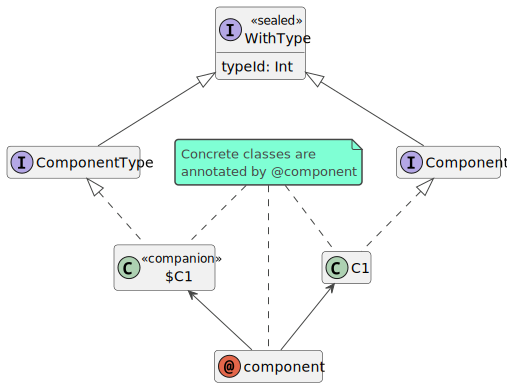
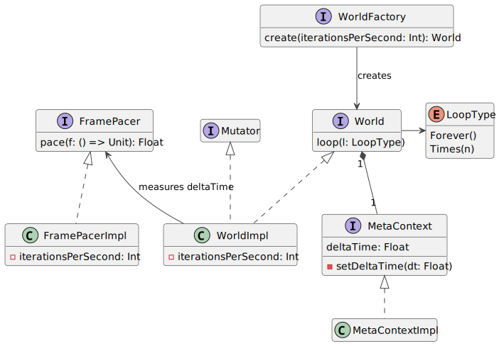
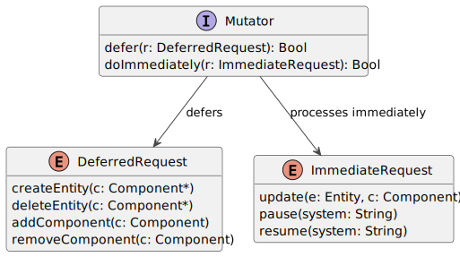

# Implementazione

Non sono state utilizzate librerie esterne per la realizzazione di questo framework.

Alcuni dettagli implementativi, come l'implementazione degli Archetype, sono stati omessi poiché si ritiene che non avrebbero aggiunto informazioni rilevanti oltre a quanto è già stato detto nel precedente capitolo.

## `@component`

Scala permette facilmente di dichiarare un `ComponentType` che faccia riferimento a una specifica specializzazione di `Component` attraverso i *companion object*. Supponendo di avere un'implementazione di `Component` chiamata `C1` e il suo companion object omonimo che implementi `ComponentType`, il problema di sincronizzare i loro `typeId` è stato risolto creando una `MacroAnnotation`. Il seguente diagramma raffigura questo tipo di implementazione:



In Scala:

```scala
@component
class C1 extends Component
object C1 extends ComponentType
```

L'annotazione `@component` modifica l'AST della classe annotata e del suo companion object effettuando l'override del campo `typeId`. Si è deciso di assegnarvi come valore l'hash code del nome qualificato della classe privato di eventuali simboli come `.` e `$`, così da ottenere la medesima stringa a partire sia dal nome della classe stessa che da quello del suo companion object. Internamente, viene utilizzato il metodo di libreria `MurmurHash3.stringHash` per il calcolo dell'hash code.

Inoltre, `@component` si assicura che la classe annotata sia stata definita correttamente, ovvero verifica che essa implementi il trait `Component` e che il suo companion object esista e implementi `ComponentType`. Se l'utente tenta di utilizzare un Component non annotato, il framework lancerà a runtime una `IllegalDefinitionException`, ricordando di usare l'annotazione.

Anticipando parte dell'implementazione di `Query`, questo design permette di comporre Query nel seguente modo:

```scala
query any C1 none (C2, C3) all: (e: Entity, c: C4) =>
  ...
```

dove `C1, ..., C4` sono Component definiti come nell'esempio precedente. Notare come sia sufficiente passare una lista di `ComponentType` ai metodi `none` e `any`, in contrasto con una sintassi in cui, per identificare i tipi dei Component, sia necessario ottenere gli oggetti `Class[T]` tramite il metodo `classOf[T]`. Questo approccio riduce la quantità di codice boilerplate necessaria per la scrittura delle query, a discapito però di una definizione dei Component più prolissa; tuttavia, si prevede che la creazione di System (e quindi di Query) sia un'attività più frequente in un programma ECS rispetto alla creazione di Component.

Infine, il trait `WithType` è stato definito `sealed`: non ha senso che esistano altre specializzazioni di `WithType` all'infuori di `Component` e `ComponentType`.

## Higher-kinded Components

Durante lo sviluppo del framework, è emersa la necessità di ricavare il ComponentId di una classe Component a partire da un type parameter `T`: ad esempio, il metodo `QueryBuilder.all` (con tutti i suoi overload) deve permettere alla Query di selezionare gli archetipi corretti riconducendo i tipi dei parametri della lambda ai loro ComponentId. Viene dunque introdotto il metodo `id0K[T]` (nascosto all'utente):
  
```scala
inline def id0K[T <: WithType: ClassTag]: ComponentId = getId(summon[ClassTag[T]].runtimeClass)

inline def getId(cls: Class[?]): ComponentId = ComponentId(createId(cls.getName))

def createId(clsName: String): Int = MurmurHash3.stringHash(base(clsName))
```

Questo metodo ricava il nome qualificato della classe di `T` dal parametro contestuale `ClassTag[T]`, creato automaticamente al momento della compilazione se lo si specifica o attraverso la notazione `T: ClassTag` o attraverso la keyword `using` come parte della signature del metodo. Il nome `id0K` deriva dal fatto che il metodo considera solo il tipo più esterno ai fini del calcolo dell'hash code, ignorando eventuali type parameter di tipi 1-ari o più (comportamento che rispecchia quello dell'annotazione `@component`).  
Questo pone un'importante limitazione sulle classi dei Component: ad esempio, se fosse possibile creare istanze di `A[B]` e `A[C]`, dove `A[T]` è una specializzazione generica di Component, esse avrebbero lo stesso ComponentId, cosa che causerebbe conflitti se usate contemporaneamente. È un problema potenzialmente irrisolvibile: creando una classe sulla falsariga di `ClassTag[T]` che mantenga quantomeno i nomi dei type parameter, sarebbe possibile per `id0K` creare ComponentId diversi, ma lo stesso non si può dire dell'annotazione `@component`, che non potrebbe ricavare alcuna informazione utile sui type parameter in fase di definizione della classe né tantomeno sarebbe in grado di sovrascrivere dinamicamente il valore di `typeId` in base al tipo generico di turno. Per questo motivo, `@component` blocca la compilazione del programma se la si utilizza per annotare classi generiche:

```scala
if definition.symbol.declaredTypes.nonEmpty then report.error(...)
```

dove `definition` è l'oggetto `ClassDef` che rappresenta la definizione della classe annotata.

## Query

Si è deciso di semplificare il design delle Query proposto nel capitolo 3 e di definirle come `opaque type`:

```scala
opaque type Query <: () => Unit = () => Unit
```

Il bound su `() => Unit` permette di usare il metodo `apply()` senza definire alcun extension method.

Poiché nessun'altra interfaccia dipendeva direttamente da `RegularQuery` (a parte `QueryBuilder`) e `Routine`, esse sono state rimosse, esprimendo i loro concetti tramite i seguenti factory method:

```scala
def query(using World): QueryBuilder = new QueryBuilderImpl(summon[World].archetypeManager)

def routine(f: => Unit): Query = Query(() => f)
```

dove `QueryBuilder` è rimasta pressoché invariata rispetto al suo design di dettaglio, restituendo ora una generica `Query` invece di una `RegularQuery`.

Restituendo un oggetto `QueryBuilder`, `query` permette una sintassi simil-dichiarativa già vista in un esempio nella sezione riguardante `@component` e qui riproposto:

```scala
query any C1 none (C2, C3) all: (e: Entity, c: C4) =>
  ()
```

È possibile iterare su tutte le Entity indipendentemente dai loro Component:

```scala
query all: e =>
  ()
```

La creazione delle `Routine` è ancora più semplice:

```scala
routine:
  ()
```

## World

Per semplicità, l'implementazione di World usata dal framework estende direttamente il trait `Mutator`, senza usare un oggetto dedicato. In più, per soddisfare il requisito di misurare accuratamente il tempo trascorso dopo ogni iterazione (requisito non funzionale 3), viene introdotto un nuovo elemento chiamato `FramePacer`. Questo design è rappresentato dalla seguente figura:



In Scala, `WorldFactory` non è altro che il companion object di `World`:

```scala
object World:
  def apply(iterationsPerSecond: Int = 0): World =
    WorldImpl(iterationsPerSecond)(using ArchetypeManager(), MetaContext()):

  private class WorldImpl(frameCap: Int)(using ArchetypeManager, MetaContext)
    extends World, Mutator:
      ...
```

`FramePacer.pace` esegue la lambda passata come parametro, ne misura il tempo di esecuzione restituendolo in output al chiamante e, se i secondi trascorsi sono inferiori a `1 / iterationsPerSecond`, chiama `Thread.sleep` sul thread corrente per far rispettare il numero di iterazioni al secondo voluto dall'utente (requisito utente 13). `WorldImpl` non fa altro che passare a `pace` la parte più critica del loop e assegnarne l'output al campo `MetaContext.deltaTime`:

```scala
override def loop(loopType: Loop): Unit =
  inline def _loop(): Unit =
    context.setDeltaTime(
      pacer.pace:
        ...
        for s <- activeSystems do s.update()
    )

  loopType match
    case Loop.Forever      => while true do _loop()
    case Loop.Times(times) => for _ <- 0 until times do _loop()
```

A dimostrazione del fatto che anche il requisito utente 14 è stato soddisfatto, i test `A World should update its delta time value on every iteration` (WorldTest.scala, progetto `core`) e `A FramePacer should return the correct delta time value after a call to pace()` (FramePacerTest.scala, progetto `ecsutil`) verificano il valore di deltaTime misurato con una tolleranza di `1e-8` secondi.

Si noti l'uso della keyword `inline` per evitare che venga inutilmente creato un nuovo contesto di esecuzione per il metodo annidato `_loop()` a ogni iterazione del World. Nonostante i requisiti non specifichino alcun vincolo sulle prestazioni del framework, Scala rende questo tipo di ottimizzazione molto facile da attuare e non c'è ragione per non trarne vantaggio.

Infine, vengono messi a disposizione alcuni factory method di `LoopType` per rendere la sintassi del World più vicina a un DSL custom:

```scala
world loop once    // world loop LoopType.Times(1)
world loop 2.times // world loop LoopType.Times(2)
world loop forever // world loop LoopType.Forever
```

## Mutator e "zucchero sintattico"

Il seguente diagramma mostra tutte le possibili richieste che è possibile realizzare tramite un'istanza di `Mutator`:



I nomi in *camelCase* per i case delle due enum sono voluti per creare l'illusione di una sintassi a metodi infissi come segue:

```scala
import DeferredRequest.*
import ImmediateRequest.*

mutator defer createEntity(C1(), C2())
world.entity withComponents (C1(), C2()) // Analogo a createEntity

mutator defer deleteEntity(e)

mutator defer addComponent(e, C3())

mutator defer removeComponent(e, C3)

mutator doImmediately update(e, C1())
```

Le richieste per modificare lo stato dei System sono realizzabili nel modo seguente:

```scala
if world.isSystemRunning("my_system") then
  mutator doImmediately pause("my_system")
if world.isSystemPaused("my_system") then
  mutator doImmediately resume("my_system")
```

Il trait `Entity` definisce alcuni operatori il cui scopo è semplificare la sintassi di `World` e `Mutator`:

```scala
e += C2()  
  += C3()  // Analogo a DeferredRequest.addComponent
e -= C2
  -= C3    // Analogo a DeferredRequest.removeComponent
e <== C1() // Analogo a ImmediateRequest.update
e ?> C1    // Analogo a World.hasComponents
```

`ImmediateRequest.update` sostituisce l'istanza di un Component di un'Entity con una nuova, soddisfando il requisito utente 5. Per aggiornare i valori di Component mutabili, non basta che iterare su di essi
e modificarne direttamente lo stato, come nel seguente esempio:

```scala
query all: (e: Entity, c: Counter) =>
  c.increase()
```

Questo soddisfa il requisito utente 4.

## System

È possibile creare System in due modi:

1. Passando una `Query` a `World.system`:

```scala
world.system("my_system", priority = 0): // La priorità può essere omessa (ha 0 come valore di default)
  query all: (e: Entity, c: MyComponent) =>
  ()
```
2. Estendendo il trait `System` e facendo l'override dei suoi campi:
```scala
// Deve avere World come parametro contestuale
class MySystem(priority: Int)(using World) extends System("my_system", priority):
  override val onStart: Query = ...
  override val process: Query = ...
  override val onPause: Query = ...

// In un punto diverso del codice
world.system(MySystem())
```

Pagina successiva: [ECS vs OOP: perché scegliere ECS?](5_why_ecs.md)