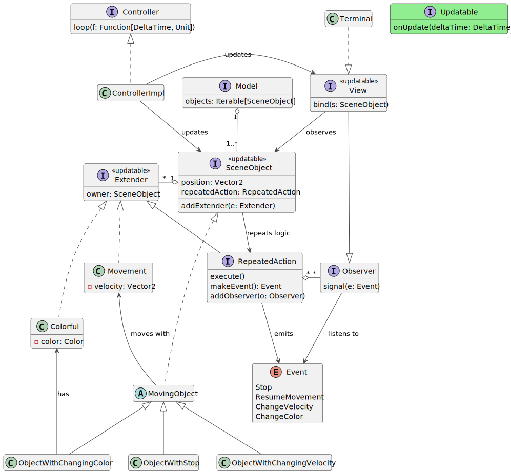
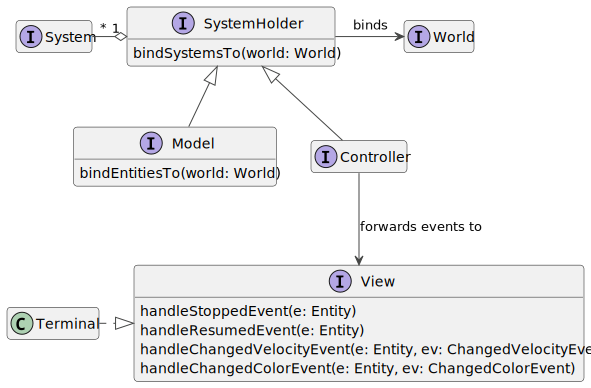

# Approccio al design di software ECS

Per confrontare in modo efficace l'architettura ECS con approcci object-oriented, verranno ora introdotte due applicazioni dimostrative, entrambe con gli stessi requisiti e logica di fondo ma realizzate una col framework ECS *ecscalibur* e l'altra in stile puramente object-oriented con architettura *Entity-Component*.

## Sintesi dei requisiti

L'applicazione di esempio deve:

- creare diversi tipi di entità con logica di movimento e azioni ripetibili a intervalli regolari
- il movimento deve avvenire in uno spazio bidimensionale
- implementare le seguenti azioni ripetibili: interruzione e ripresa del movimento, cambio di velocità, cambio di colore
- far sì che le entità ripetano le azioni all'infinito e a intervalli regolari (ad esempio, ogni 2 secondi)
- avere almeno un'entità per ogni diversa azione
- segnalare all'utente l'esecuzione delle diverse azioni ripetibili
- essere basata sull'architettura MVC

## Versione OOP

La versione object-oriented della demo si basa sull'architettura *Entity-Component*. riassunta nel seguente codice esemplificativo:

```scala
trait Component:
  def update(): Unit

class Entity:
  def addComponent(c: Component): Unit
  def removeComponent(c: Component): Unit
  def updateComponents(): Unit
```

A differenza di ECS, nelle architetture EC le Entity mantengono uno stato e gestiscono autonomamente i propri componenti ([Mertens et al.](https://github.com/SanderMertens/ecs-faq)). Per evitare confusione con la terminologia ECS, verranno usati i termini `Extender` e `SceneObject` per riferirsi rispettivamente ai Component e alle Entity dell'architettura EC.

Di seguito viene presentato il design dell'intera applicazione:



Lo stereotipo *`<<updatable>>`* indica elementi che estendono l'interfaccia `Updatable`.

In pieno stile MVC, l'applicazione è caratterizzata da apposite interfacce che modellano Model, View e Controller: `Model` istanzia gli oggetti del dominio e li rende disponibili pubblicamente alle altre interfacce; `View` funge da *observer* delle entità del Model e resta in ascolto degli eventi generati da esse; `Controller` è il collante che collega le entità del Model alla View e aggiorna tutti gli elementi in gioco a intervalli regolari.

`SceneObject` rappresenta le entità di base del dominio: come da requisiti, dispongono di una *posizione* 2D e di un Extender di default, `RepeatableAction`, che permette di eseguire logica arbitraria a intervalli ben definiti. Ogni `SceneObject` può estendere le proprie funzionalità aggiungendo altri oggetti `Extender`, che qui possono rappresentare azioni o campi aggiuntivi come `Movement` e `Colorful`.

I tre tipi di entità richiesti sono rappresentati dalle classi `ObjectWithStop`, `ObjectWithChangingVelocity` e `ObjectWithChangingColor`, i quali possono muoversi in uno spazio 2D grazie alla classe astratta `MovingObject` ed eseguire azioni specifiche. Le loro azioni emettono eventi: ad esempio, `ObjectWithChangingVelocity` emette l'evento `ChangeVelocity` attraverso `RepeatableAction`, il quale si occupa di segnalarlo a eventuali `Observer` in ascolto.

Lo stato dell'applicazione viene emesso sul terminale attraverso la specializzazione di `View`, `Terminal`.

## Versione ECS

Come da requisiti, anche la versione ECS della demo è basata su architettura MVC, come espresso dal seguente diagramma:



In breve, la View viene modellata come elemento separato dall'architettura ECS. I suoi metodi vengono richiamati dai System definiti all'interno del Controller, che si occupa di fare da tramite tra la View e il Model.

Si è voluto replicare nella versione ECS il design a eventi introdotto nella versione OOP. Di conseguenza, vengono introdotti 3 tipi diversi di `Component`:

- Component 'plain', ovvero `Position`, `Velocity` e `Colorful`
- *Intention*, che rappresentano l'intenzione di una Entity di eseguire una particolare azione: ad esempio, il componente `StopMovementIntention` comunica l'intenzione di arrestare il proprio movimento. Altre *intention* sono `ResumeMovementIntention`, `ChangeVelocityIntention` e `ChangeColorIntention`
- *Event*: rappresentano eventi emessi all'esecuzione delle azioni appena elencate. Essi vengono 'consumati' dai System del Controller (ergo, rimossi dalle Entity che li hanno emessi) e inoltrati alla View

I System del Model sono:

- `MovementSystem`: itera sulle Entity con `Velocity` e `Position` e ne aggiorna la posizione in base alla velocità
- `StopSystem`: itera sulle Entity con intention `StopMovementIntention` e ne azzera la velocità
- `ResumeSystem`: itera sulle Entity con intention `ResumeMovementIntention` e ne ripristina la velocità
- `ChangeVelocitySystem`: modifica la velocità delle Entity con intention `ChangeVelocityIntention`
- `ChangeColorSystem`: modifica il colore delle Entity con intention `ChangeColorIntention`
- `UpdateTimerSystem`: incrementa il valore del timer delle Entity con componente `Timer` o lo riporta a 0 se ha raggiunto il valore dell'intervallo desiderato
  - tutti i precedenti System eseguono la propria logica solo se il timer ha raggiunto il valore desiderato

Viene dato qui un esempio in codice Scala di uno dei System appena elencati:

```scala
private[ecsdemo] final class StopSystem(priority: Int)(using World) 
    extends System("stop", priority):
  override protected val process: Query =
    query none ResumeMovementIntention all:
      (e: Entity, v: Velocity, w: StopMovementIntention, t: Timer) =>
        timed(t):
          v.vec = Vector2.zero
          e -= StopMovementIntention
            += StoppedEvent()
            += ResumeMovementIntention(w.originalVelocity)
          ()
```

dove il metodo `timed()` esegue la logica passatagli come lambda nel seguente modo:

```scala
private inline def timed(t: Timer)(inline f: => Unit): Unit =
  if t.isReady then f
```

I System del Controller rimangono in attesa degli eventi emessi dal Model:

- `ConsumeParameterlessEventsSystem` reagisce agli eventi `StoppedEvent` e `ResumedMovementEvent`
- `ConsumeChangedVelocityEventSystem` reagisce all'evento `ChangedVelocityEvent`
- `ConsumeChangedColorEventSystem` reagisce all'evento `ChangedColorEvent`

Di seguito un esempio in codice Scala:

```scala
private[ecsdemo] final class ConsumeParameterlessEventsSystem(priority: Int)(using World, View)
    extends System("viewNoParameters", priority):
  override protected val process: Query =
    query any (StoppedEvent, ResumedMovementEvent) all: (e: Entity) =>
      if e ?> StoppedEvent then
        e -= StoppedEvent
        summon[View].handleStoppedEvent(e)
      else if e ?> ResumedMovementEvent then
        e -= ResumedMovementEvent
        summon[View].handleResumedEvent(e)
```

## Confronto

Entrambe le versioni soddisfano i requisiti richiesti. Tuttavia, i due design rispondono in modo diverso a cambiamenti nei requisiti. Di seguito vengono analizzate alcune casistiche che mettano in luce le differenze tra i due approcci.

### Caso 1: creare un tipo di entità che cambi colore e velocità contemporaneamente

#### Soluzione OOP

Si può creare una nuova classe che estenda `ObjectWithChangingColor` e che, a ogni update, modifichi la propria velocità in modo analogo a `ObjectWithChangingVelocity` ed emetta un nuovo evento facendo l'override dei metodi di `RepeatableAction`, magari rifattorizzando il codice di `ObjectWithChangingVelocity` per estrarre della logica riutilizzabile dalla nuova classe.

Un modo alternativo che eviti di creare catene di ereditarietà consiste nell'estendere `MovingObject` e replicare la logica sia di `ObjectWithChangingVelocity` che di `ObjectWithChangingColor`. Questo approccio potrebbe portare a codice duplicato, col vantaggio però di non dipendere da una classe che in futuro potrebbe venire modificata a causa di ulteriori cambi di requisiti.

#### Soluzione ECS

Si crea un nuovo System che iteri sulle Entity con i componenti `ChangeVelocityIntention`, `Velocity`, `ChangeColorIntention` e `Colorful`, magari rifattorizzando il codice dei due System già esistenti per estrarre logica riutilizzabile. A questo punto, basta creare una nuova Entity e aggiungervi i suddetti Component.

#### Differenze

Notiamo fin da subito come non esista un modo chiaramente migliore di soddisfare questo nuovo requisito nella versione OOP, dal momento che entrambi hanno i loro vantaggi e svantaggi. Al contrario, ragionare in termini di ECS conduce a un'unica e semplice soluzione che permette di riadattare il codice senza sforzi.

### Caso 2: creare un tipo di entità che cambi colore a intervalli regolari ma senza logica di movimento 

#### Soluzione OOP

Si crea una nuova classe che implementi direttamente `SceneObject` e abbia l'Extender `Colorful`, facendo l'override dei metodi di `RepeatableAction` e replicando la logica di `ObjectWithChangingColor`. Valgono anche qui le stesse considerazioni sulla rifattorizzazione del codice comune.

#### Soluzione ECS

Si crea un'Entity con i componenti `Position`, `Colorful` e `ChangingColorIntention`.

#### Differenze

In questo caso, la soluzione ECS richiede ancora meno sforzi poiché tutta la logica di cui si ha bisogno è già presente sotto forma dei System esistenti.

### Caso 3: creare un tipo di entità che cambi velocità e colore, ma che emetta solo eventi riguardanti il cambio di velocità

#### Soluzione OOP

Se si è verificato anche il caso 1, si estende la classe creata e si fa l'override dei metodi di `RepeatableAction`, emettendo eventi solo quando si verificano cambiamenti di velocità, altrimenti si crea una nuova classe seguendo l'approccio illustrato nel caso 1.

#### Soluzione ECS

Si crea un nuovo System che iteri sulle Entity con i componenti `ChangeVelocityIntention`, `Velocity`, `ChangeColorIntention` e `Colorful` come nel caso 1, ma si aggiunge alle Entity solo l'evento `ChangeVelocityEvent`.

#### Differenze

A livello di complessità, le due soluzioni sono pressoché equivalenti, col vantaggio della soluzione OOP di poter estendere quella presentata per il caso 1 senza grosse difficoltà.

### Tirando le somme

Nonostante le demo qui esposte non si avvicinino neanche lontanamente alla complessità ed eterogeneità di sistemi reali e non sia quindi possibile procedere con analisi più profonde, attraverso i precedenti tre casi si trova conferma di quanto scritto nel precedente capitolo riguardo alla qualità del codice: la versione ECS è facilmente adattabile a cambiamenti nei requisiti, mentre la versione OOP, nonostante anche l'architettura Entity-Component risponda bene ai cambiamenti, necessita di più refactoring, indice di un certo grado di rigidità del codice.

Pagina successiva: [Approccio al TDD con ECS](7_tdd_ecs.md)
